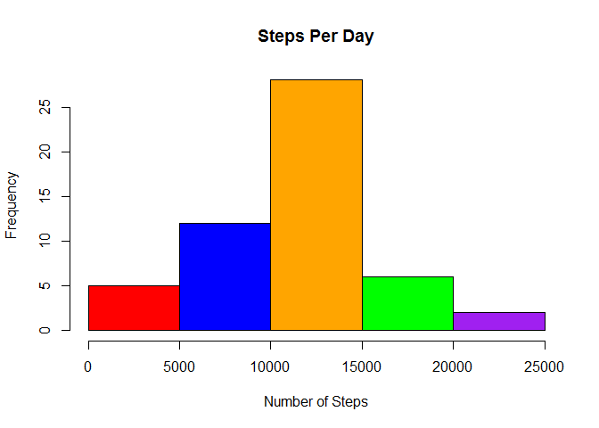
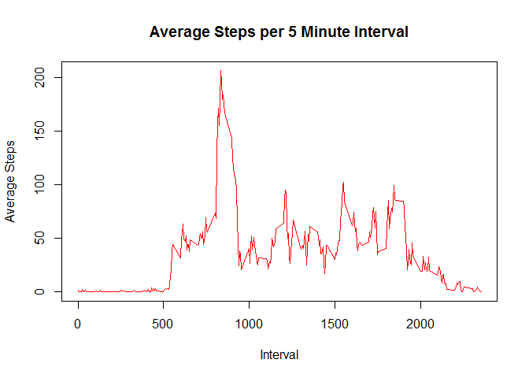
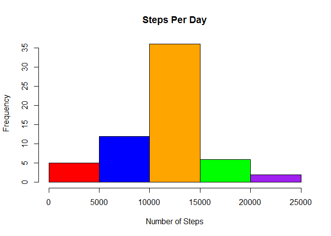
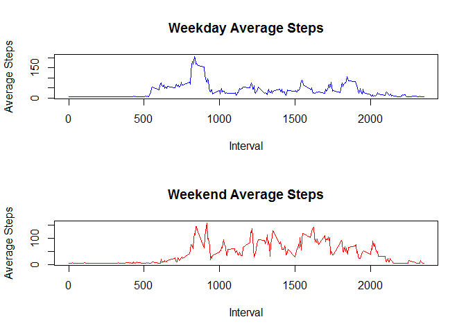

# ReproducableResearch_CourseProject1
Kate Choomack  
July 22, 2016  
**Attach dplyr package**

```
## 
## Attaching package: 'dplyr'
```

```
## The following objects are masked from 'package:stats':
## 
##     filter, lag
```

```
## The following objects are masked from 'package:base':
## 
##     intersect, setdiff, setequal, union
```

**Initial read of the data and processing into day rollup**
*Reads the file, removes NA values, and aggrigates by day, summing the steps per day*


```r
stepdata <- read.csv("activity.csv")
stepdata_rmna <- na.omit(stepdata)
stepdataday <- aggregate(stepdata_rmna$steps,by=list((substr(stepdata_rmna$date,1,30))),sum)
```

**Histagram of total Steps per Day**


```r
colors = c("red", "blue", "orange", "green", "purple")
hist(stepdataday$x, col=colors, main="Steps Per Day", xlab = "Number of Steps")
```

<!-- -->

**Mean and Media Steps per Day**


```r
mean(stepdataday$x)
```

```
## [1] 10766.19
```

```r
median(stepdataday$x)
```

```
## [1] 10765
```

**Time series plot of average steps taken**
*First, create a dataframe with average steps per interval, then create the time series plot*


```r
stepdata_ts <- stepdata_rmna %>% group_by(interval) %>% summarize(avg_steps=mean(steps))

plot(stepdata_ts$interval, stepdata_ts$avg_steps,type="l",
     main="Average Steps per 5 Minute Interval", 
     col="red", xlab="Interval",ylab="Average Steps")
```

<!-- -->

**The 5 minute interval that contains the maximum average number of steps**


```r
max_step_intvl <- stepdata_ts$interval[which.max(stepdata_ts$avg_steps)]
```

**Replacement of missing data with estimated values**
1 - Created a new dataframe called stepdata2 which is identical to the initial dataframe
2 - Replaced the NA values with the mean of the steps
3 - Repeated the aggrigate step to create a dataframe summarizing the step data by date
*This did not have much of an effect on the median and mean.  The histogram looked similar to the original.*


```r
stepdata2 <- stepdata
stepdata2$steps[is.na(stepdata2$steps)] <- mean(stepdata2$steps, na.rm = TRUE)
stepdataday2 <- aggregate(stepdata2$steps,by=list((substr(stepdata2$date,1,30))),sum)
```

**Histogram of Steps Per Day after missing data is replaced**


```r
colors = c("red", "blue", "orange", "green", "purple")
hist(stepdataday2$x, col=colors, main="Steps Per Day", xlab = "Number of Steps")
```

<!-- -->
**Panel plot comparing the average number of steps taken per 5-minute interval across weekdays and weekends**
1 - Ensure the date column is still date type.
2 - First re-create the data from a previous step with average steps per 5-minute interval using 
data with replaced NA values.
3 - Next, create a dataframe indicating if a date is a Weekend or a Weekday


```r
stepdata2$date <- as.Date(stepdata2$date)
stepdata2_ts <- stepdata2 %>% group_by(interval) %>% summarize(avg_steps=mean(steps))
#the following steps re-create the dataframe with "weekday" or "weekend" for the date
stepdata2$day <- weekdays(stepdata2$date)
stepdata2$daytype <- "Weekday"
stepdata2$daytype[stepdata2$day %in% c("Saturday", "Sunday")] <- "Weekend"
#summarizes the average steps per interval by type of day
AvgStepsDay <- stepdata2 %>% group_by(daytype,interval) %>% summarize(Avg_Steps=mean(steps))
#create two variables filtering for Weekday or Weekend
weekday_data <- AvgStepsDay %>% filter(daytype == "Weekday")
weekend_data <- AvgStepsDay %>% filter(daytype == "Weekend")
#create the panel plot showing weekend and weekday data
par(mfrow=c(2,1))
plot(weekday_data$interval, weekday_data$Avg_Steps, type="l", 
     col="blue", xlab="Interval",ylab="Average Steps",
     main="Weekday Average Steps")
plot(weekend_data$interval, weekend_data$Avg_Steps, type="l", 
     col="red", xlab="Interval",ylab="Average Steps",
     main="Weekend Average Steps")
```

<!-- -->


